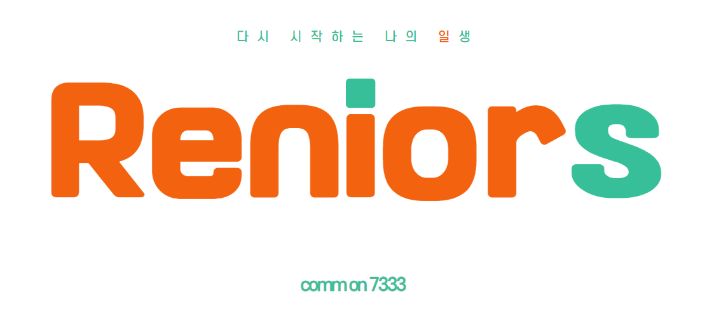

# Reniors

리니어즈 _Reniors_

> Reniors는 ‘Restart’와 ‘Seniors’를 합성한 단어로 시니어분들의 새로운 시작을 응원한다는 뜻을 가지고 있습니다.

## 📅 개발 기간

**2022.07.05 ~ 2022.08.19** (7주)

(SSAFY 7기 공통프로젝트)

## 🎞 서비스 소개 영상

[YOUTUBE](https://www.youtube.com/watch?v=NqIQzAWTg6U)

## 👑 팀원

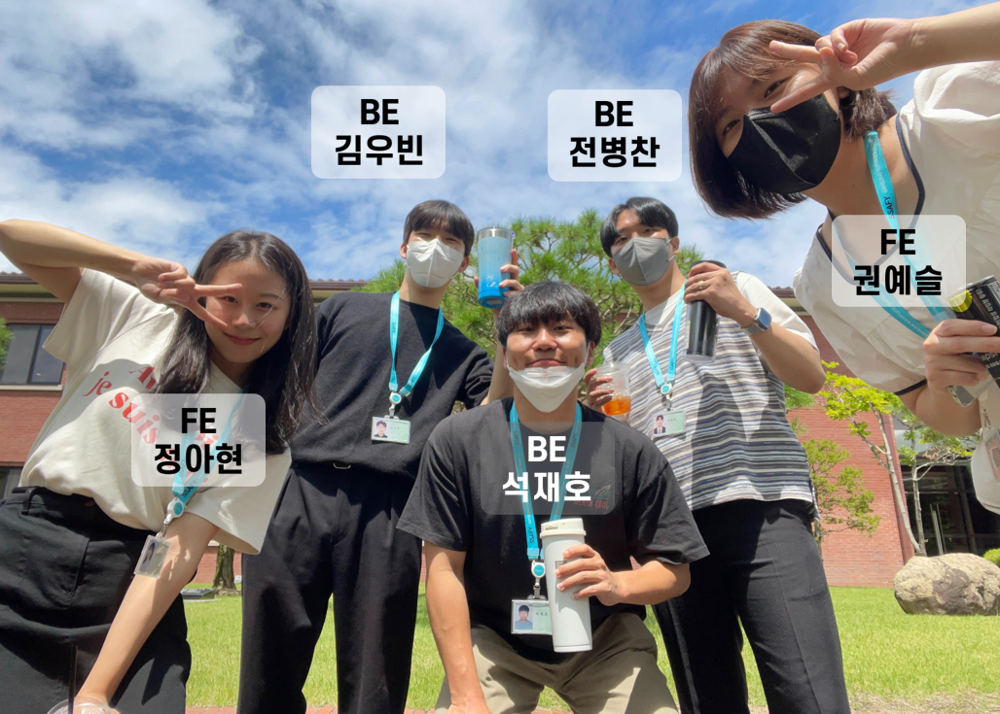

| 🏍 김우빈                         | 📢 권예슬                        | 🍮 석재호                        | 🎙 전병찬                         | 🎀 정아현                        |
| -------------------------------- | -------------------------------- | -------------------------------- | -------------------------------- | :------------------------------- |
|  |  |  |  |  |
| **팀장**                         | 팀원                             | 팀원                             | 팀원                             | 팀원                             |
| BE                               | FE                               | BE, Infra                        | BE                               | FE                               |

## 🛠️ 기술 스택

### 🛰 Infra

    

     

    

### 💎 Front-End

 

    

    
    

### 👩🏻‍🔧 Back-End

    

    
    
    
    
 

 

## 📑 프로젝트 개요 및 소개

### ❗ 액티브시니어를 위한 취업지원 서비스

**늘어나는 기대 수명에 비해 짧아지는 은퇴 시기로 인하여 은퇴 이후에 새로운 도전 시작을 하는 액티브 시니어분들이 등장하였습니다. 그리하여 액티브 시니어분들의 새로운 도전을 지원할 수 있도록 직관적이고 사용하기 쉬운 구인구직 서비스를 기획하였습니다.**

### ❗ 다시 시작하는 나의 일생

**Reniors는 시니어분들을 대상으로 하는 구인구직 서비스이기 때문에 시니어분들에게 보다 간편한 구직 프로세스를 제공합니다.**

---

- 포트폴리오 및 이력서를 쉽게 작성할 수 있도록 선택형 방식의 이력서 작성 양식 지원
- 기업(구인자)과 지원자(구직자)간의 화상 면접 플랫폼 제공 및 면접 연습 기능
- 화상 면접 시 지원자의 이력서나 포트폴리오, 사전에 준비한 면접 질문 등을 동시에 확인하며 면접을 진행할 수 있는 편리한 UI제공
- 면접 날짜와 시간을 한눈에 확인할 수 있는 나만의 캘린더 지원
- 북마크 기능을 통한 편리한 관심공고 관리 가능
- 카카오 로그인 지원
- 회사 정보 확인
- 관심 공고 설정

## 👷🏻‍♂️ 아키텍처

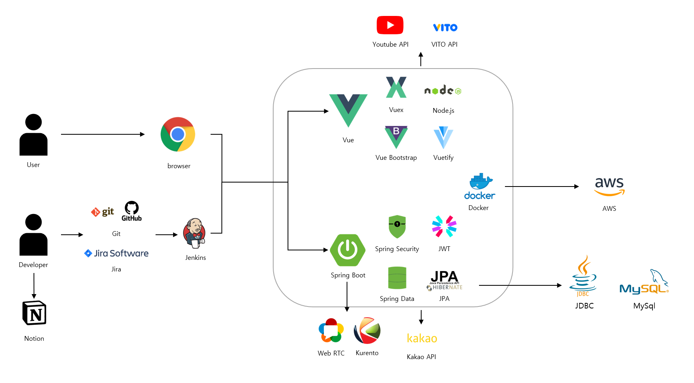

## 👐 협업 환경

- Gitlab
  - 코드의 버전을 관리
  - 이슈 발행, 해결을 위한 토론
- JIRA
  - 매주 목표량을 설정하여 Sprint 진행
  - 업무의 Story Point를 설정하고 작업
- 회의
  - Webex를 활용하여 오전/오후 스크럼 회의 진행
  - 작일 작업과 금일 작업을 브리핑
  - 빠른 소통과 신속한 대응이 가능
- Notion
  - 회의를 진행하는 경우 회의록을 작성하여 기록
  - 기술 습득 시, 다른 팀원들이 쉽게 참고할 수 있도록 흐름에 맞게 정리
  - 각종 컨벤션 지정 및 정리
  - 스토리보드, ER 다이어그램, 기능명세서 등 협업에 필요한 문서 기록 및 관리

## 📌 주요 기능

### ✔ 로그인

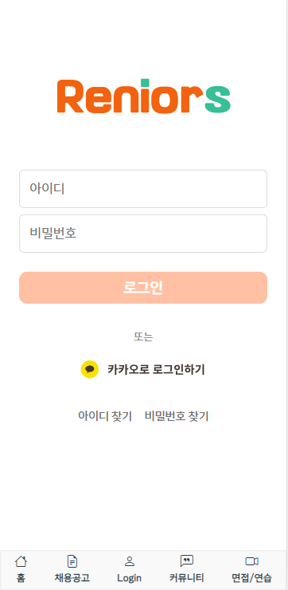

- 카카오 소셜 로그인 및 리니어즈 자체 회원가입이 가능합니다.
- 아이디와 비밀번호 찾기 기능을 제공합니다.

### ✔ 메인 화면

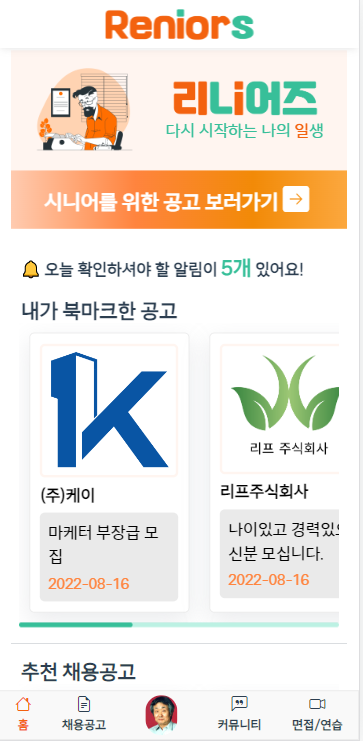

- 홈 화면에서 북마크 한 공고를 볼 수 있습니다.
- 북마크 한 공고와 동일한 직무의 공고 정보를 추천 채용 공고 메뉴를 통해 제공합니다.

### ✔ 채용 공고 탭

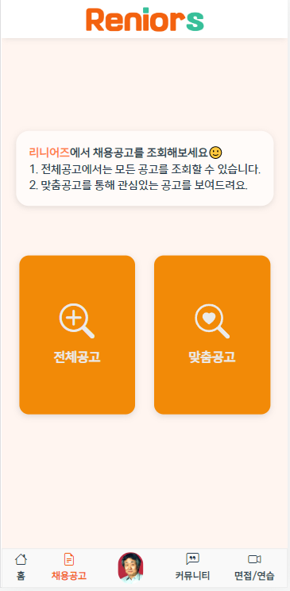

- 전체 공고를 조회할 수 있는 메뉴과, 본인이 설정한 조건에 맞는 공고를 제공하는 맞춤 공고 메뉴입니다.

### ✔ 전체 공고

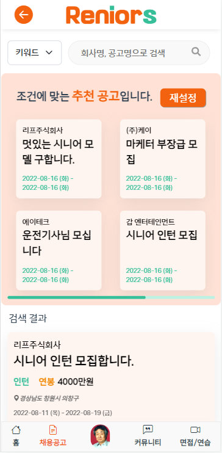

- 전체 공고를 조회할 수 있습니다.
- 페이지 상단에서는 추천 공고를 보여줍니다.
- 키워드 및 회사명으로 검색이 가능합니다.

### ✔ 채용 공고 디테일

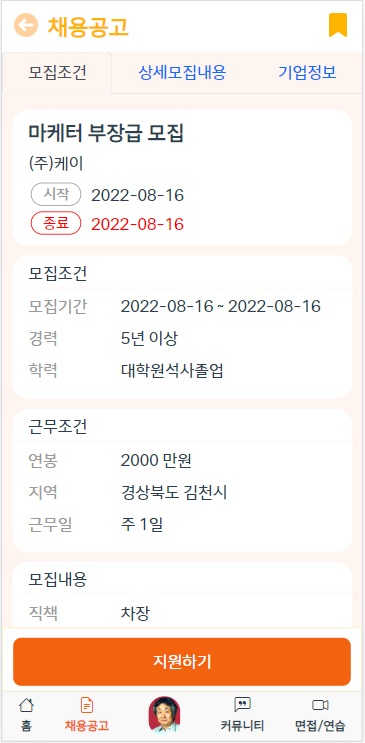

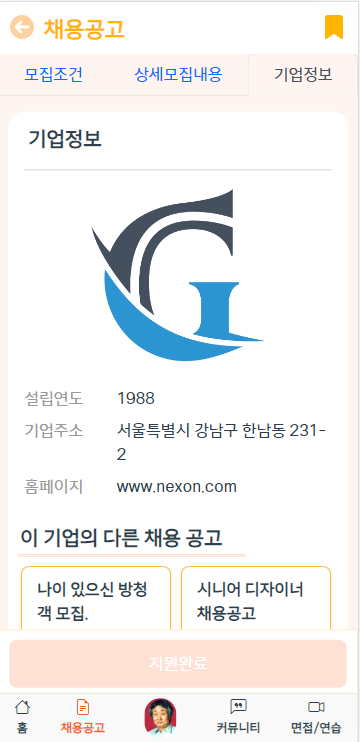

- 채용 공고를 자세히 볼 수 있는 페이지입니다.
- 상단의 3가지 메뉴를 통해 유저가 편리하게 해당 공고의 정보를 확인할 수 있도록 하였습니다.

### ✔ 추천 공고

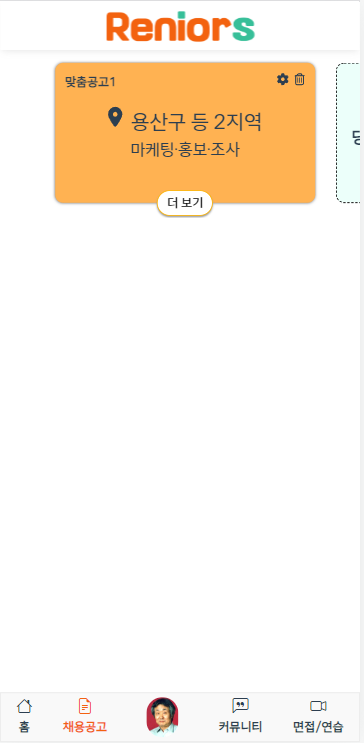

- 본인이 설정한 조건으로 공고를 필터링하여 보여줍니다.

### ✔ 커뮤니티 탭

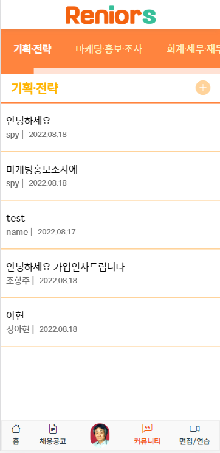

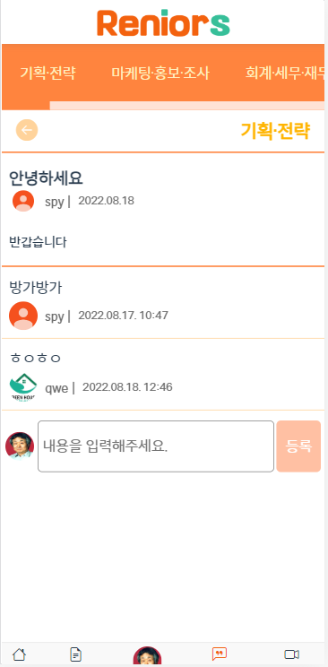

- 직무 별 커뮤니티를 제공합니다.
- 커뮤니티 게시판에서는 글을 작성하고 조회, 수정, 삭제가 모두 가능하며, 댓글 또한 작성이 가능합니다.

### ✔ 면접/연습 탭

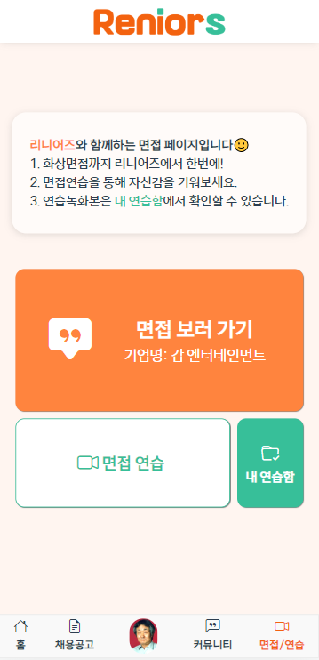

- 리니어즈에서는 면접 연습을 할 수 있으며, 구인 기업의 필요에 따라 실제 화상 면접까지 진행할 수 있습니다.

### ✔ 면접 연습 준비 페이지

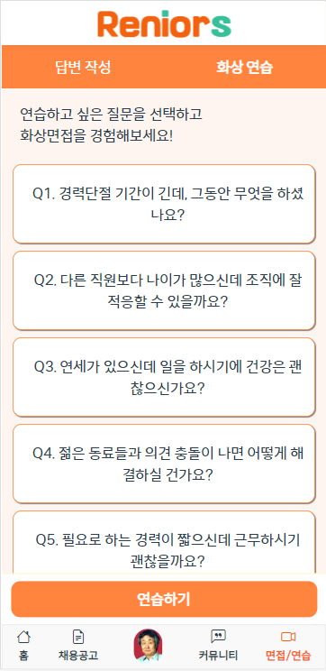

- 면접 연습 준비 페이지에서는 리니어즈에서 제공하는 시니어 분들의 면접에 나올 수 있는 여러 질문에 대해 자신만의 답변 작성이 가능하며, 화상 연습 탭에서 연습할 질문을 선택한 후 바로 연습을 진행할 수 있습니다.

### ✔ 화상 면접 연습

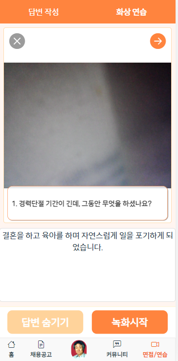

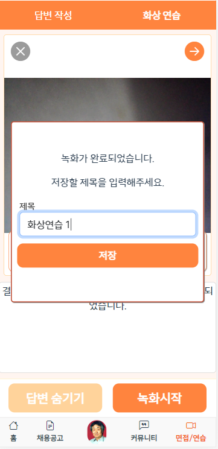

- 선택한 질문에 대해 사전에 작성한 답변을 보고 연습할 수 있으며, 필요에 따라 숨길 수도 있습니다.
- 시니어 분들에게 더욱 실전과 비슷한 면접 연습 기능을 제공하기 위해 TTS를 사용하여 질문을 읽어줍니다.
- 녹화 시작 버튼을 클릭하면 즉시 현재 영상 및 음성이 녹화되며, 녹화 중지 버튼을 클릭하는 시점에 저장됩니다.
- 저장된 영상은 직접 파일명을 지정할 수 있고, 면접 연습함 페이지에서 언제든지 재생할 수 있습니다.

### ✔ 면접 연습함

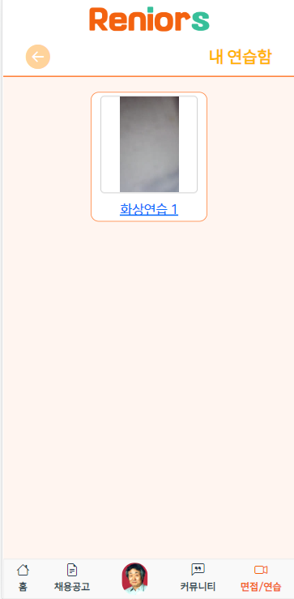

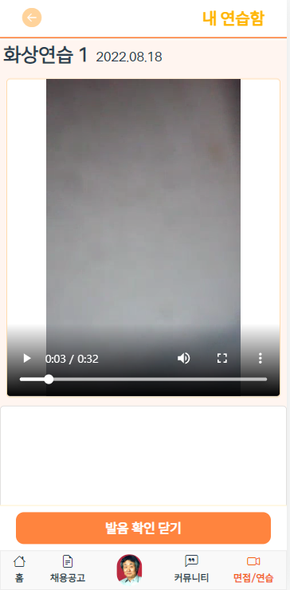

- 화상 면접 연습 시 저장된 연습 영상을 확인할 수 있는 페이지입니다.
- 저장된 영상은 생성된 시간 및 날짜 순서에 따라 정렬됩니다.
- 영상을 재생하게 되면 연습을 진행했던 본인의 모습과 목소리를 바로 확인할 수 있으며, 추후 분석에 실질적인 도움을 주기 위해 STT를 사용하여 본인의 답변을 텍스트 형식으로 제공합니다.

### ✔ 마이페이지

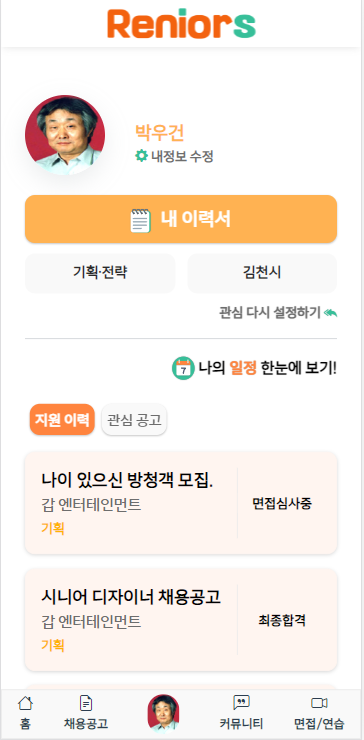

- 유저의 정보와 이력서, 선호하는 관심 직무, 지원 이력, 관심 공고를 확인할 수 있으며, "나의 일정 한눈에 보기" 메뉴를 통해 예정된 면접 일정을 달력 및 리스트 형태로 제공합니다.

### ✔ 기업 메인 화면

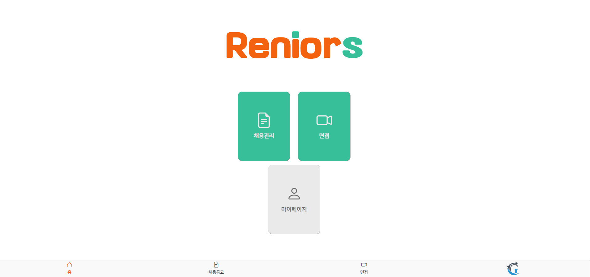

- 기업 계정 로그인 시 보여지는 메인 화면입니다.
- 채용 관리, 면접, 마이페이지(기업 정보) 메뉴가 있습니다.

### ✔ 채용 공고 탭

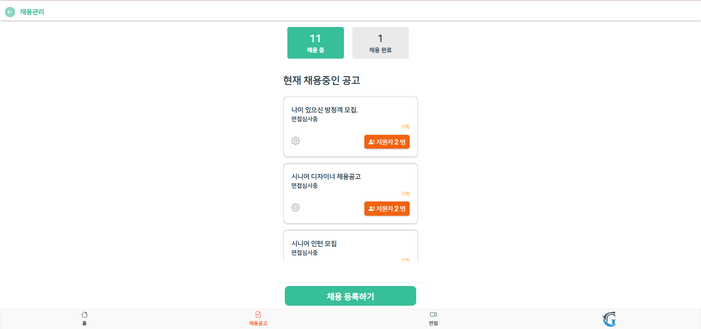

- 해당 기업에서 게시한 공고를 조회할 수 있습니다.
- 공고 제목과 현재 진행 과정, 모집 분야, 총 지원자 수 정보를 한눈에 확인할 수 있습니다.

### ✔ 공고 디테일

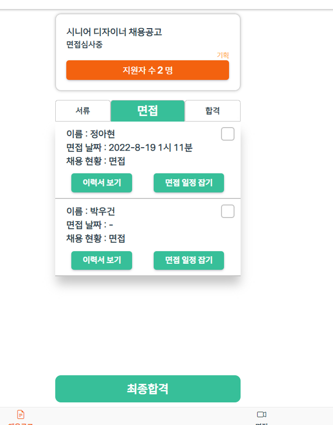

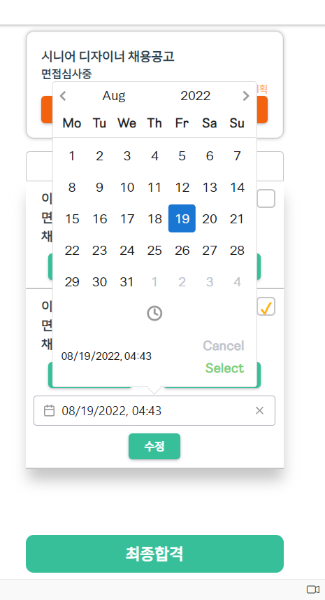

- 리니어즈에서는 채용 단계를 크게 3가지(서류, 면접, 합격)로 규격화하여 각 과정에 맞는 지원자 관리 기능을 제공하고 있습니다.
- 기업의 편의를 위하여 체크박스를 활용하여 여러 지원자에 대해 일괄적인 관리가 가능하며, 면접 일정을 손쉽게 지정할 수 있고, 해당 지원자의 이력서 또한 간편하게 확인할 수 있습니다.

### ✔ 면접

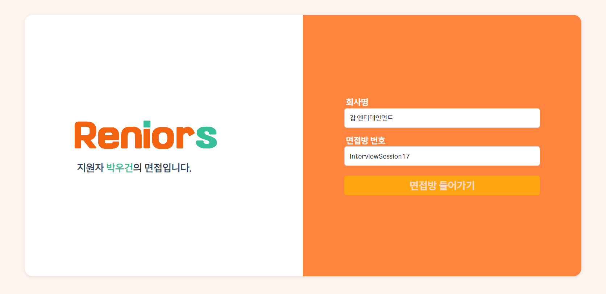

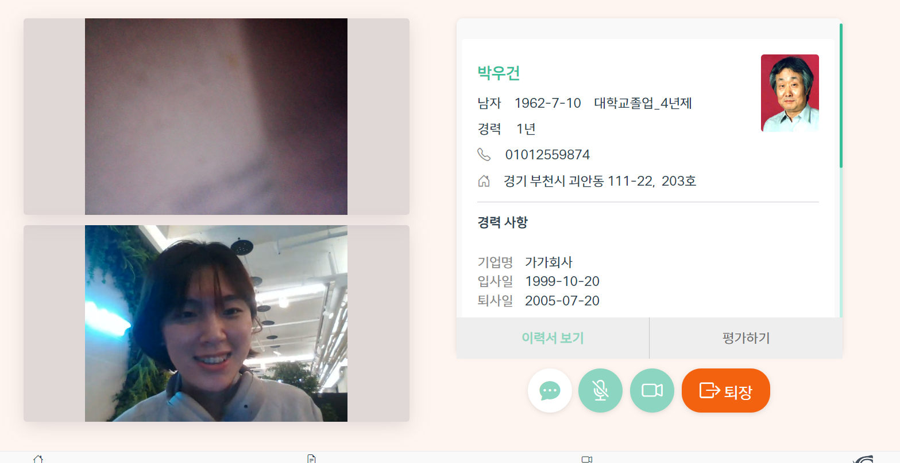

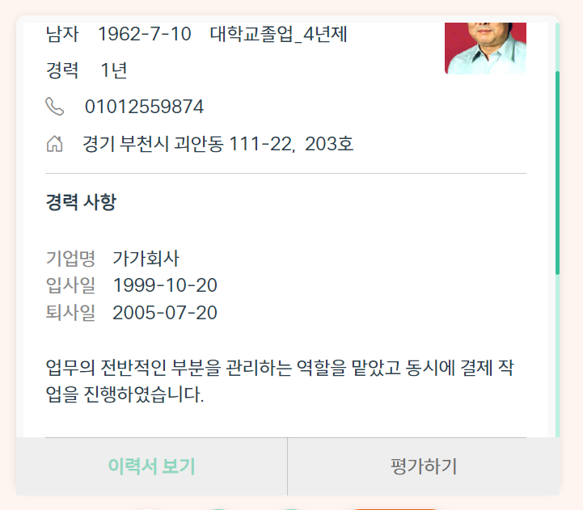

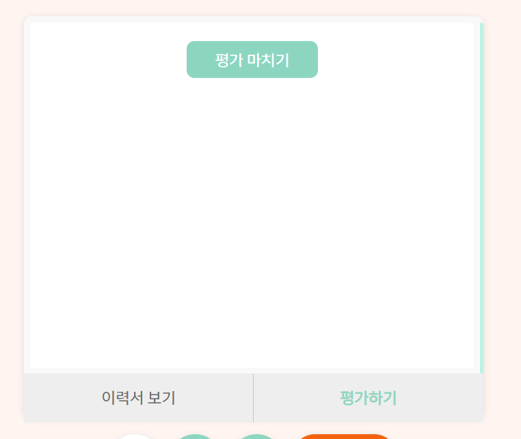

- 지원자와 화상 면접을 진행할 수 있습니다.
- 지원자의 인적사항 및 이력서를 면접 진행 중에도 언제든지 확인할 수 있습니다.
- 평가하기 탭에서는 사전에 작성해 놓은 면접 질문과 함께 평가 폼이 제공되어 면접과 동시에 평가 진행이 가능합니다.

## 🔗 Wiki

### 🤝🏻 Team Notion

- [Team Notion](https://soapy-haddock-e90.notion.site/B307-792f1a4e7e1a40ac96bea9361b484ff1)
  - 기획, 설계, 와이어프레임, 스크럼, 기능 명세, API 명세, ERD

### 🛳 Porting manual

- [Porting manual](./exec/)
  - 빌드 가이드, 외부 서비스, DB 덤프, 시연 시나리오
